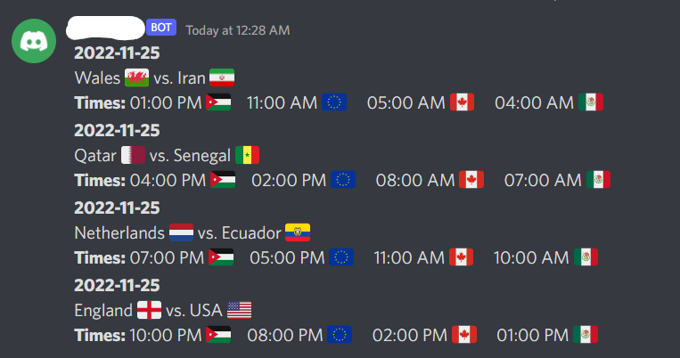

# World Cup 2022 Discord Bot
This repository contains the code I wrote in Python for a Discord Bot, which I created as part of my new Discord server for my close friends and I to follow the FIFA World Cup 2022.

## What This Bot Does
The first feature is that I created a command which when run, sends all of the games for today, where the messages would be sent in the `#todays-games` channel on the server. This is part of the `sendmatches` function in `bot.py`.

The message would contain:
- The Home and Away teams with their corresponding emojis (emojis are rendered through a custom dictionary, containing key/value pairs of country names and emojis)
- The match time, in 4 different time zones. The API gives me data in UTC time, and I parse the time using `datetime` and then use the `timedelta` function to add/subtract hours. I then render the time in 12-hour format, along with a corresponding country emoji for the timezone.

This is an example of how the message would look like:

The second feature is that under a channel called `#choose-your-team`, I created a message in which I had the bot react to it with several flag emojis. The reason is people can see these flags and react to the message themselves. When the person **reacts** to the message, the `on_raw_reaction_add` function from *Discord.py* is used, and the emoji is parsed from the payload event. Depending on that emoji, the user gets added to a role, which represents a team that they support. The user can react with multiple flags, and it will add them to the corresponding roles. The `on_raw_reaction_remove` function is used to remove the roles when the reaction is removed.

The third feature is a delete command, which takes in an argument of how many messages to delete. The way this command works is that across the whole bot, a **command prefix** was defined, which is `!`. Then, the function name is `delete`, which takes in `ctx` and `arg`.
The `ctx` object stands for **context**, which helps us know the channel the user sent the message in. The argument in this case would be used in the limit parameter of the `purge` function. A sample command would be: `!delete 5`. Sending this will delete the last 5 messages, including the message you just sent.

## Cloud Deployment
I am using Heroku to deploy this bot on the cloud. They offer 550 hours of free deployment, which is what I am using as of November 24th.